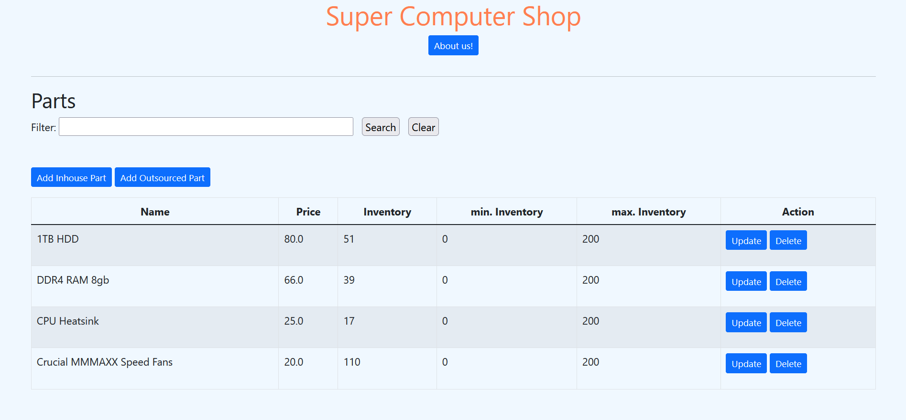
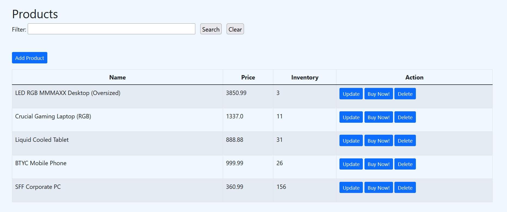
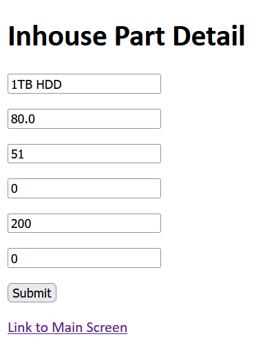
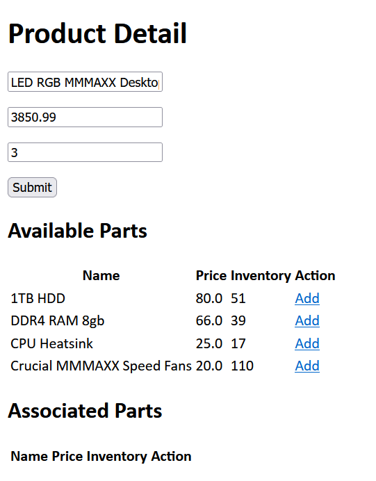
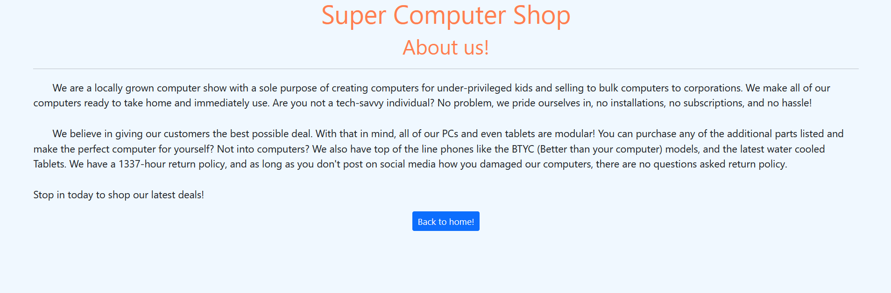

# inventory-management-system
Java based Inventory Management system for a fictious computer store. It is a warehouse management system for the tracking and sale of parts and products. 
The web application uses Java Spring framework in conjunction with Bootstrap, Maven, Thymelead, and the H2 database for storing information. It has 6 navigable pages to manipulate product
and part inventory, as well as an about page for the business.  

To view code on github without downloading, navigate to the Super_computer_shop_WMS -> src -> main -> java -> com -> example -> demo: 
This will show controllers, repositories, services, and validators for the application.  

Usage / installation: 
1. Downloan project as a Zip file.  
2. Open "Super_computer_shop_WMS" in Intellij Community edition.  
3. Under src -> main -> java -> com.example.demo, select DemoApplication. 
4. Press run in (green arrow) at top right with DemoApplication opened in Intellij. 
5. Naviagte to your browser and open "http://localhost:8080/mainscreen". 
6. This web application is not intended for resale or actual usage.  

Home screen: 

  

Products page for adding, removing, or selling an item:  

  

Part add or removal page: 

  

Product add or removal page:  

  

About page for business information:  

  
